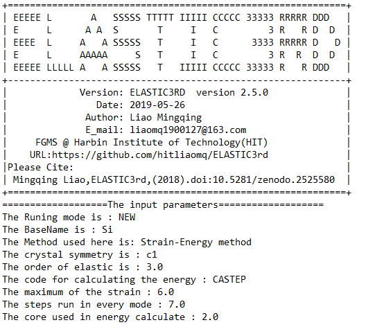
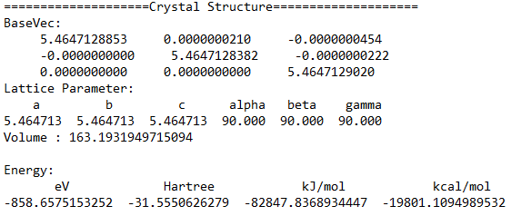
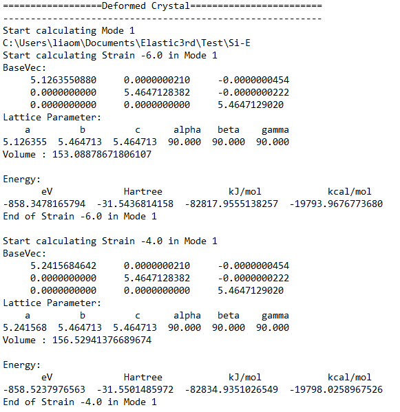
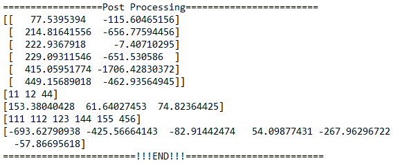

============
Get Started
============

Simplest way to run
===================

- Prepare the `INPUT` file and the input file for first principlec code
- Enter the folder
- Simply run ``elastic3rd run``

Inputs
======

The inputs for Elastic3rd can be divided into two parts. The first one is the INPUT file, and the second is the input files for first princples code.

INPUT
-----

===========  =======  =======================================================================================
Parameters   Default  Comments
===========  =======  =======================================================================================
BaseName     Si       The folder name of the result. In addition, 
                        For CASTEP, it must equals to the name of *cell* and *param* file
                        For VASP, no above required
CrystalType  Cubic1   The symmetry of the crystal. It should be one of the followings
                        triclinic or n, monoclinic or m, orthorhombic or o, tetragonal1 or t1
                        tetragonal2 or t2, rhombohedral1 or r1, rhombohedral2 or r2
                        hexagonal1 or h1, hexagonal2 or h2, cubic1 or c1, cubic2 or c2
Ord          3        The order of elastic constants
EnergyCode   CASTEP   The first principles code, currently support CASTEP and VASP
EnergyRun    1        The way to run the first principles code
                        1 is the default way. For CASTEP: RunCASTEP -np NP BaseName
                                              For VASP: mpirun -np NP vasp_std
                        0 means user defined. It will read the *energyrun* file in elastic3rd/energy folder.
                          And it can be overwrite by elastic3rd.energy.glue.write_energyrun(RunStr) function
MaxStrain    5        The maximum strain, in unit of %. e.g. 5 means the strain range is -5% to 5%
STEPS        5        The number of points in each strain mode
NP           1        The number of cores used in the first principles codes
===========  =======  =======================================================================================

First principles inputs
-----------------------
- CASTEP
  For CASTEP, two files are required for calculating, *BaseName.cell* and *BaseName.param*. For details, ref. `CASTEP files`_ .

.. _`CASTEP files`: http://www.tcm.phy.cam.ac.uk/castep/documentation/WebHelp/content/modules/castep/expcastepfileformats.htm

- VASP
  To run VASP, four files are required: *INCAR*, *POSCAR*, *KPOINTS* and *POTCAR*. For details, ref. `VASP files`_ .

.. _`VASP files`: https://www.vasp.at/wiki/index.php/Category:Input_Files

Calculation
===========

Using CASTEP or VASP
--------------------
Currently, Elastic3rd support CASTEP and VASP to calculate the energy or stress. Hence, the user can call vasp or castep by setting the INPUT file.

Note: The CASTEP is tested using the CASTEP module in Materials Studio. By default, the user should provide RunCASTEP.bat (windows) or RunCASTEP.sh (linux) in current folder. Usually, this file loacted in `Materials_Studio_ install_path\etc\CASTEP\bin`

For VASP, it runs vasp by `mpirun -np NP vasp_std`. So, please ensure that mpirun and vasp_std can be found in yout PATH.

Using other first principles code
---------------------------------
If the user want to use other first principles code to calculate the energy of stress, the user only need to prepare the following thing:

- write a python file named with the code's name(e.g. qe.py, lower required) under elastic3rd/energy/
  
  In this file, the user need to write the following functions

  - get_base_vec(BaseName): this function get the lattice vector from the code's input file
  - write_base_vec(BaseName, BaseVec): this function write out the lattice vector to the code's input file
  - run(NP, BaseName): this function return the string to run the code
  - get_energy(BaseName): this function get the energy from the code's output file
  - copy_files(BaseName, Path): this function copy the required files of the code

- Then in the INPUT file, the file can call the code by specify "EnergyCode  QE"

Post
====

The SOECs and TOECs (only taking second and third order effect into consideration) are printed in the log file on the screen.

If the author want to taken higher-order effect into consideration, the user can run `elastic3rd post` command in the folder where the job submitted or use `Elastic3rdPost.py` script in the `example` folder

For `elastic3rd post` command, please use `-h` for detail help.

For test, the user can run `elastic3rd post` in the `example/Si/CASTEP` folder directly.

Outputs
=======

The structure of outputs
------------------------
All the output are stored in the folder named BaseName, of which the value is set in INPUT file. The following is the structure of the results.

|FileStructure|

.. |FileStructure| image:: Output-FileStructure.png

Output files
------------
This section gives an explanation for each file generated by Elastic3rd.

=================  =================================================================================
File name          Comments
=================  =================================================================================
INPUT              A backup of INPUT file
EEnergy.txt        The energy of each strain mode(each column) and each strain(each row)
Energy_Strain.txt  The energy of single strain, in which there are several values in different unit
Energy_Mode.txt    The eneargy of single strain mode. In unit of eV
=================  =================================================================================

=======  ========================================================
Folders  Comments
=======  ========================================================
Mode0    This folder contains the result of undeformed structure
ModeN    This folder contains the result of differen strain modes
StrainN  This folder contains the result of different strains
=======  ========================================================

Note: here N is integer and N>0

Log file
--------

By default, the log file is not saved, but print in the screen. And it can be saved by re-direction.

It can be divided into four parts

- Part1: the logo part
|log1| 

- Part2: the result of intial structure
|log2|

- Part3: the result of different strains and strain modes
|log3|

- Part4: the post process part
|log4|

