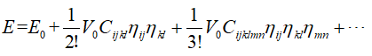
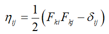
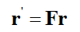
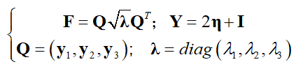
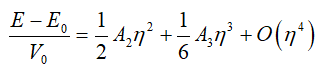

=================
Theory Background
=================

The strain-energy method to calculate TOECs is based on the conituumn elasticity theory. The base equation is as follows (note: the Einstein summation notation is used in the following equations):

|eq1|

Where

- :math:`E` is the energy of the deformed structure

- :math:`E_0` is the energy of the initial structure

- :math:`V_0` is the volume of the initial structure

- :math:`C_{ijkl}` is SOECs

- :math: `C_{ijklmn}` is TOECs

- :math:`\eta_{ij}` is the Lagrangian strain

And the Lagrangian strain can be written as follows:

|eq2|

The F is the deformation gradient, and can be expressed by the lattic vector of deformed structure(r') and intial structure (r).

|eq3|

|eq4|

|eq5|

