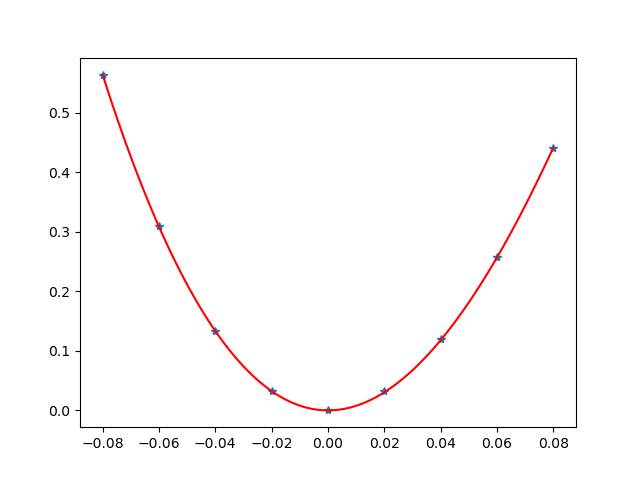

========
Examples
========

Submit jobs
-----------

There are several examples in `example` folder.

For Si and C, both VASP and CASTEP input files are prepared in the folder, and for Mg, only CASTEP input file is prepared.

The user can run these examples by following steps

1.  For copy right, the author can't provide the RunCASTEP.bat or RunCASTEP.sh (for CASTEP) and POTCAR (for VASP) files. The user should provide these file in the current folder.

- For CASTEP, the user should copy `RunCASTEP.bat` or `RunCASTEP.sh` in their Materils Studio installation folder.

- For VASP, the user should provide the `POTCAR` file

2. Submit the job

There are several ways to submit the job.

- Using `elastic3rd run` command.

- Using the `runElastic3rd.py` (in `example` folder) script by running `python runElastic3rd.py`. If the user want to save the log into file, please run `python runElastic3rd.py >> Result.txt`

- Submit jobs in queue system. If the user want to run Elastic3rd in queue system, the following is an example. Please note that it assume the python and vasp is exists in the `PATH`

.. code::

    #PBS -l nodes=1:ppn=24
    #PBS -l walltime=48:00:00
    #PBS -l pmem=8gb
    #PBS -A open
    #PBS -j oe

    cd $PBS_O_WORKDIR
     
    python runElastic3rd.py

Post
----

There are several ways to do the post processing.

- Using `elastic3rd post` command

Assumpt that the current folder is the folder where the job has been submitted. When enter the current folder, the user can do the post process by `elastic3rd post` to get the SOECs and TOECs. For more options, please run `elastic3rd post -h`.

For test, the user can run elastic3rd post in the `example/Si/CASTEP` folder directly. It should print the following lines in the screen.

.. code::
    ELASTIC3RD version: 2.5.1
    Copyright © FGMS @ HIT

    BaseVec:
         5.4647128853     0.0000000210     -0.0000000454
         -0.0000000000     5.4647128382     -0.0000000222
         0.0000000000     0.0000000000     5.4647129020
    Lattice Parameter:
        a         b         c      alpha   beta    gamma
    5.464713  5.464713  5.464713  90.000  90.000  90.000
    Volume : 163.1931949715094

    [11 12 44]
    [153.05111127  65.0171889   73.22518077]
    [111 112 123 144 155 456]
    [-703.9889652  -435.4462948   -88.79485798   71.7458725  -257.35598339
      -51.04707056]

- Using `Elastic3rdPost.py` script

Change some parameters (e.g. `Flag_Ord`) by the user, then run `python Elastic3rdPost.py`

By running this script, it will print the following thing in the screen and show some figures of fitting result (here only show 1 figure)

.. code::
    BaseVec:
         5.4647128853     0.0000000210     -0.0000000454
         -0.0000000000     5.4647128382     -0.0000000222
         0.0000000000     0.0000000000     5.4647129020
    Lattice Parameter:
        a         b         c      alpha   beta    gamma
    5.464713  5.464713  5.464713  90.000  90.000  90.000
    Volume : 163.1931949715094

    [  77.22101104 -117.33149423]
    [ 217.27559666 -670.10928332]
    [218.3870861   26.16025386]
    [ 227.66199634 -632.04346107]
    [  424.89246807 -1747.1282253 ]
    [ 439.3186686  -408.37656319]
    [153.05111127  65.01718889  73.22518077]
    [-703.98896537 -435.44629486  -88.79485803   71.74587404 -257.35598342
      -51.0470704 ]

|FittingFig|

- By calling the `post` or `post_single` or `post_mode` from `elastic3rd.post.post`

Ref `Elastic3rdPost.py`.