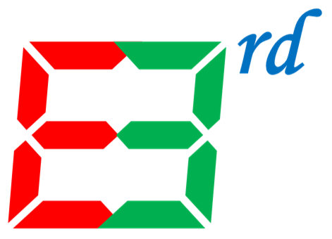

.. Read the Docs Template documentation master file, created by
   sphinx-quickstart on Tue Aug 26 14:19:49 2014.
   You can adapt this file completely to your liking, but it should at least
   contain the root `toctree` directive.

|logo| ELASTIC3rd: An Open Source Code to Calculate Higher-Order Elastic Constants(HOECs) from First Principles
==============================================================================================

Contents:

.. toctree::
   :maxdepth: 2
   :glob:

   Introduction
   Get Started <GetStart>
   Theory Background <Theory>
   Examples
   FAQ
   API

   *

Indices and tables
==================

* :ref:`genindex`
* :ref:`modindex`
* :ref:`search`

